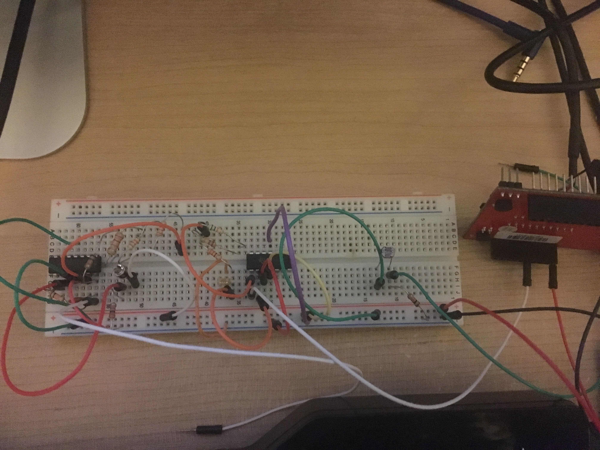
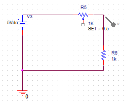
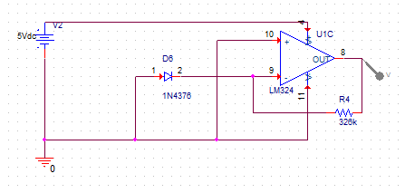
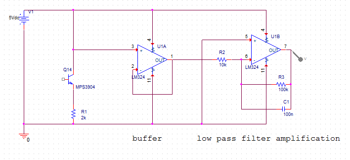
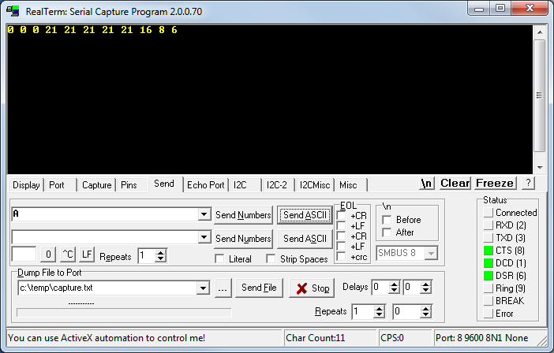

# Sensors and Signal Conditioning
One of the biggest limitations of the microcontroller is the fact that it lives in a digital world. We need certain components to be able to translate the analog world to the digital world and vice-versa. In this lab, we need to be able to convert some electrical phenomena into something our microcontroller can understand. For this, we need a few building blocks to do this.

## MSP430G2553 code
```c
/*
Matt Mammarelli
9/18/17
ECE 09342-2
*/

//MSP430G2553 Sensors and Signal Conditioning
//Type A in serial to print current value of sensor

#include  "msp430g2253.h"

unsigned int ADC_value=0;

void initAdc(void);

void main(void)
{
    {
        // Stop WDT
        WDTCTL = WDTPW + WDTHOLD;

        // If calibration constant erased
        if (CALBC1_1MHZ==0xFF)
        {
            // do not load
                 while(1);
         }
        // Select lowest DCOx and MODx settings
        DCOCTL = 0;
        // Set range   DCOCTL = CALDCO_1MHZ;
        BCSCTL1 = CALBC1_1MHZ;
        DCOCTL = CALDCO_1MHZ;
        // P1.1 = RXD, P1.2=TXD
        P1SEL = BIT1 + BIT2 ;
        // P1.1 = RXD, P1.2=TXD
        P1SEL2 = BIT1 + BIT2 ;
        // SMCLK
        UCA0CTL1 |= UCSSEL_2;
        // 1MHz 9600
        UCA0BR0 = 104;
        // 1MHz 9600
        UCA0BR1 = 0;
        // Modulation UCBRSx = 1
        UCA0MCTL = UCBRS0;
        // **Initialize USCI state machine**
        UCA0CTL1 &= ~UCSWRST;
        // Enable USCI_A0 RX interrupt
        IE2 |= UCA0RXIE;


        // SMCLK = DCO = 1MHz
        BCSCTL2 &= ~(DIVS_3);
        // ADC input pin P1.3
        P1SEL |= BIT3;
        // ADC set-up function call
        initAdc();
        // Enable interrupts.
        __enable_interrupt();

        while(1)
        {
            // Wait for ADC Ref to settle
            __delay_cycles(1000);
            // Sampling and conversion start
            ADC10CTL0 |= ENC + ADC10SC;
            // Low Power Mode 0 with interrupts enabled
            __bis_SR_register(CPUOFF + GIE);
            //set adc value
            ADC_value = ADC10MEM;

        }

    }
}

//ADC10 interrupt
#pragma vector=ADC10_VECTOR
__interrupt void ADC10_ISR (void)
{
    // Return to active mode
    __bic_SR_register_on_exit(CPUOFF);
}

//ADC set-up
void initAdc(void)
{

    // Channel 3, ADC10CLK/3
    ADC10CTL1 = INCH_3 + ADC10DIV_3 ;
    //Vcc and Vss reference, Sample and hold for 64 Clock cycles, ADC on, ADC interrupt enable
    ADC10CTL0 = SREF_0 + ADC10SHT_3 + ADC10ON + ADC10IE;
    // ADC input enable P1.3
    ADC10AE0 |= BIT3;
}


//UART
//  Echo back RXed character, confirm TX buffer is ready first
#if defined(__TI_COMPILER_VERSION__) || defined(__IAR_SYSTEMS_ICC__)
#pragma vector=USCIAB0RX_VECTOR
__interrupt void USCI0RX_ISR(void)
#elif defined(__GNUC__)
void __attribute__ ((interrupt(USCIAB0RX_VECTOR))) USCI0RX_ISR (void)
#else
#error Compiler not supported!
#endif
{
  // USCI_A0 TX buffer ready?
  while (!(IFG2&UCA0TXIFG));

  //if input is A print out the ADC
  if(UCA0RXBUF == 65){
      UCA0TXBUF = ADC10MEM; //skips a clockcycle of setting adc_value
  }
  //else print out 66 
  else{
      UCA0TXBUF = 66;
  }

}
```

## Breadboard


## Photoresistor Circuit


## Photoresistor Serial


## Photodiode Circuit


## Photodiode Serial


## Phototransistor Circuit


## Phototransistor Serial

