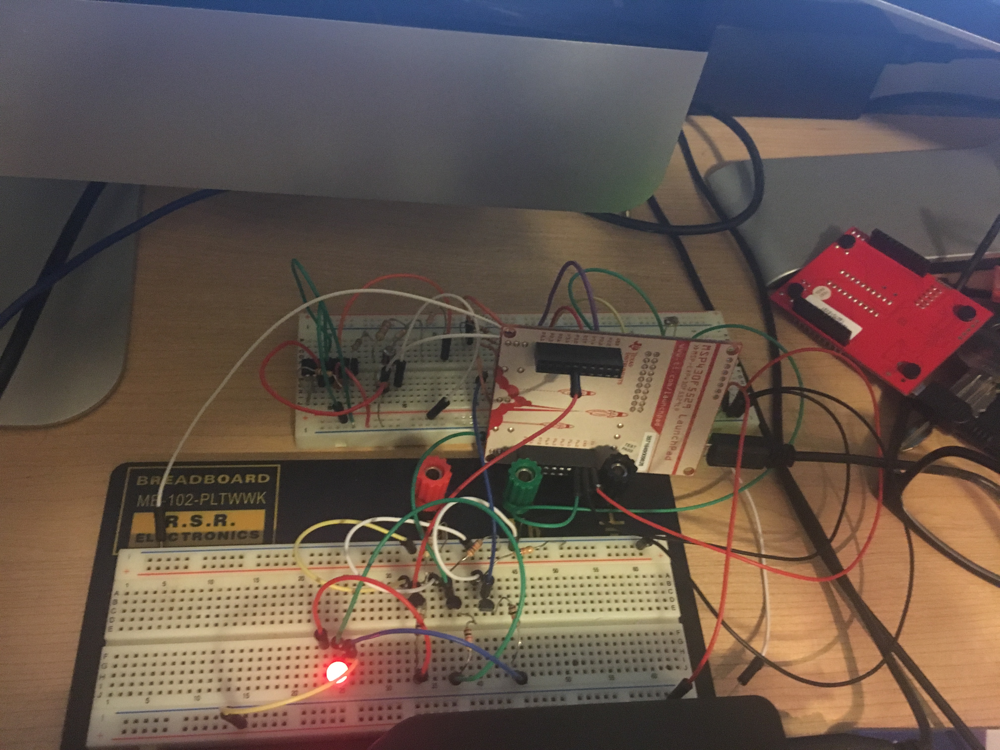
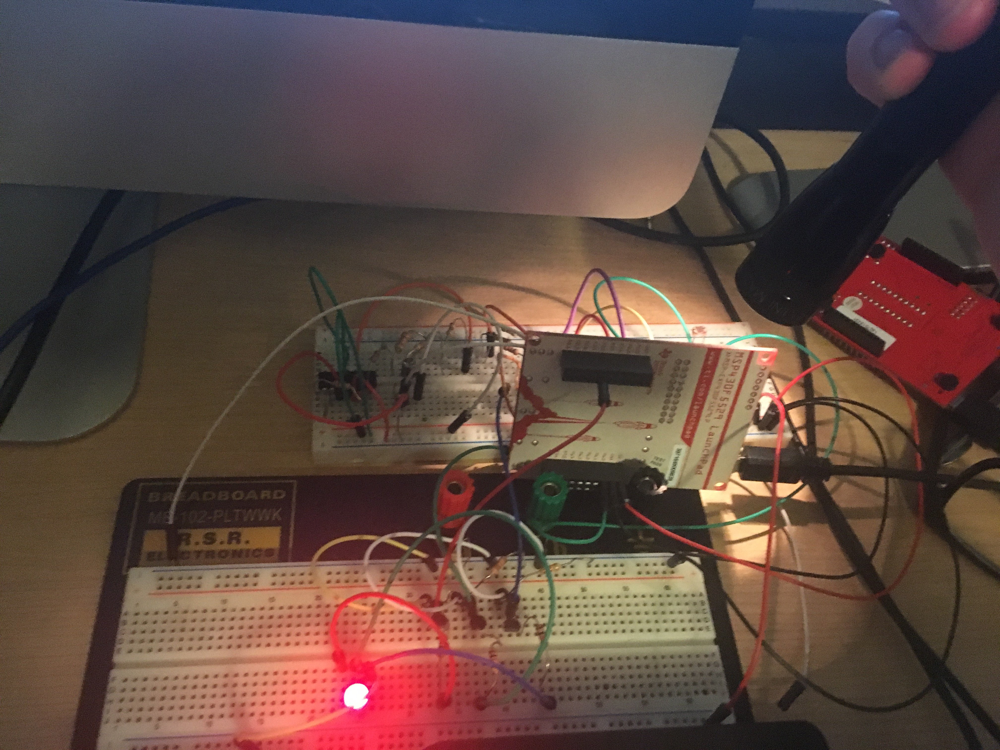
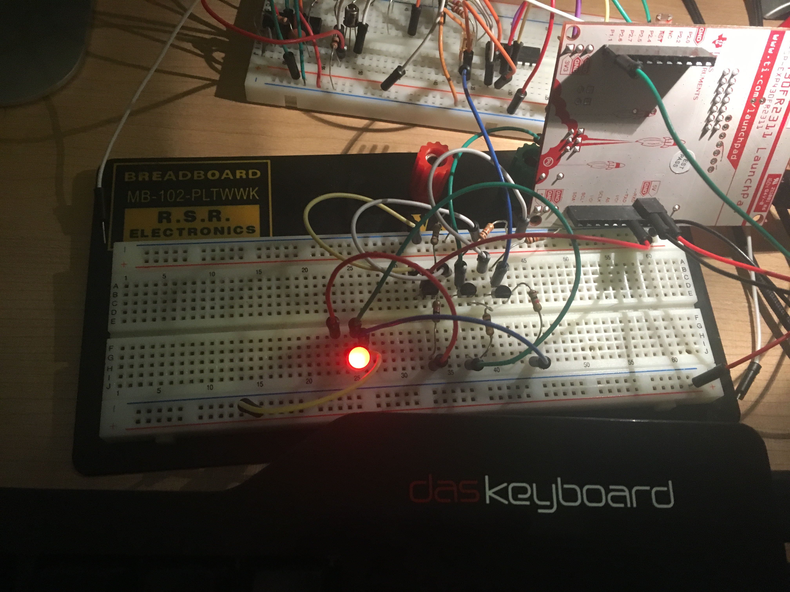
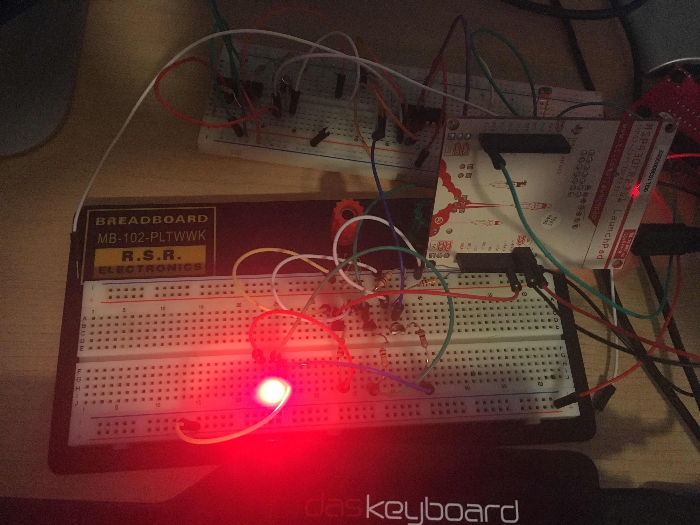
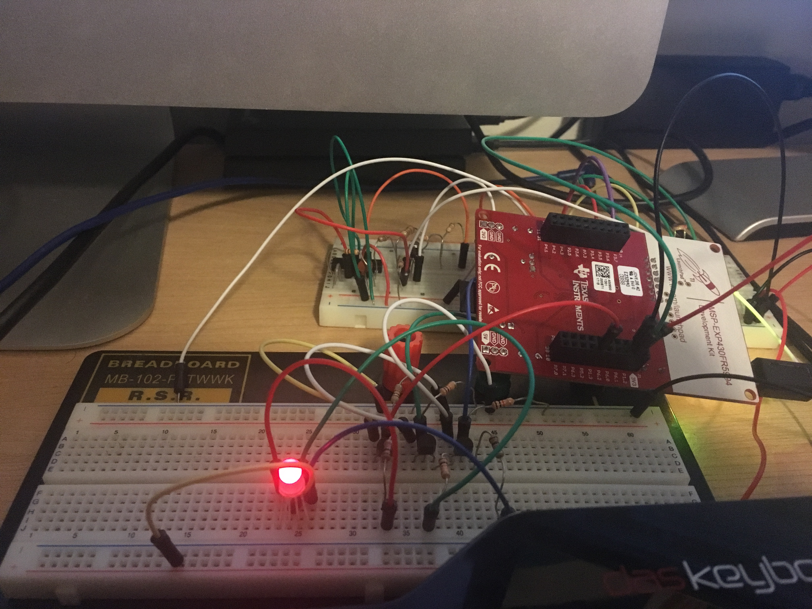
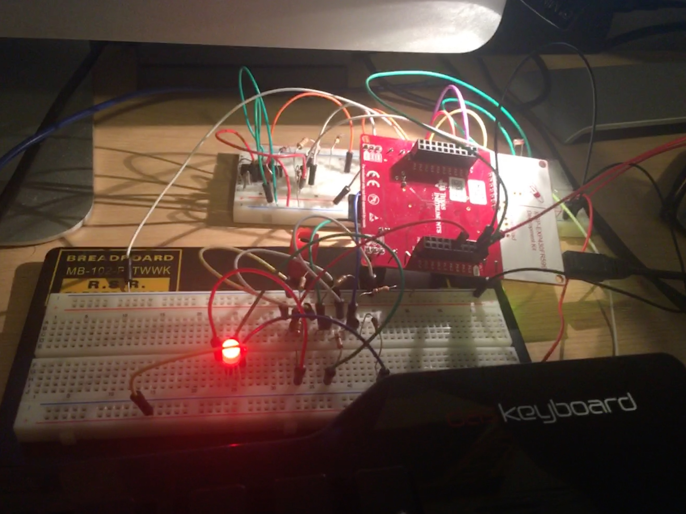
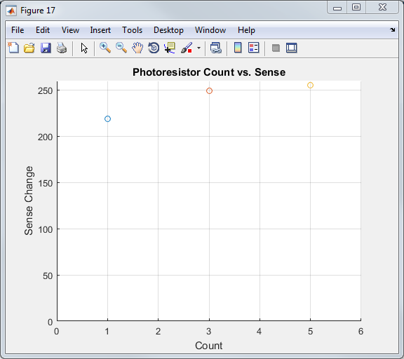
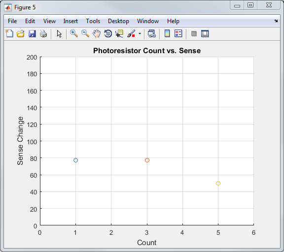
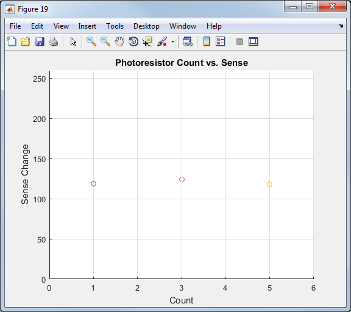

# Visualizing Data
Information from three sensors was captured using the ADC then displayed using the RGB LED, the LCD on the MSP430FR6989, plots in MATLAB, and a simultaneous RGB and MATLAB test.
## RGB LED MSP430F5529, MSP430FR2311, MSP430FR5994
The built in ADC in the MSP430 was utilized to convert an analog value from a photoresistor, photodiode, and phototransistor into a digital value.
Then PWM was utilized to control the brightness of the red RGB led based on the received sensor value.

### MSP430F5529 Code

```c
/*
Matt Mammarelli
9/18/17
ECE 09342-2
*/

//MSP430F5529 Visualizing Data RGB LED
//Changes the duty cycle of the red color in the RGB LED based on the ADC value for the photoresistor

#include <msp430.h>

int main(void)
{
  WDTCTL = WDTPW + WDTHOLD;                 // Stop WDT
  ADC12CTL0 = ADC12SHT02 + ADC12ON;         // Sampling time, ADC12 on
  ADC12CTL1 = ADC12SHP;                     // Use sampling timer
  ADC12IE = 0x01;                           // Enable interrupt
  ADC12CTL0 |= ADC12ENC;
  P6SEL |= 0x01;                            // P6.0 ADC option select
  P1DIR |= 0x01;                            // P1.0 output

  //rgb pwm *****************************************************************************************

    // P1.2 output
    P1DIR |= BIT2;

    // P1.2  options select GPIO
    P1SEL |= BIT2;

    // PWM Period about 1khz
    TA0CCR0 = 1024;

    // CCR1 reset/set
    TA0CCTL1 = OUTMOD_7;


    // SMCLK, up mode, clear TAR
    TA0CTL = TASSEL_2 + MC_1 + TACLR;

    //***************************************************************************************************


  while (1)
  {
    ADC12CTL0 |= ADC12SC;                   // Start sampling/conversion
    __bis_SR_register(LPM0_bits + GIE);     // LPM0, ADC12_ISR will force exit
    __no_operation();                       // For debugger
  }
}

#if defined(__TI_COMPILER_VERSION__) || defined(__IAR_SYSTEMS_ICC__)
#pragma vector = ADC12_VECTOR
__interrupt void ADC12_ISR(void)
#elif defined(__GNUC__)
void __attribute__ ((interrupt(ADC12_VECTOR))) ADC12_ISR (void)
#else
#error Compiler not supported!
#endif
{
  switch(__even_in_range(ADC12IV,34))
  {
  case  0: break;                           // Vector  0:  No interrupt
  case  2: break;                           // Vector  2:  ADC overflow
  case  4: break;                           // Vector  4:  ADC timing overflow
  case  6:                                  // Vector  6:  ADC12IFG0

        TA0CCR1 = ADC12MEM0/5; //changes duty cycle

    __bic_SR_register_on_exit(LPM0_bits);   // Exit active CPU
  case  8: break;                           // Vector  8:  ADC12IFG1
  case 10: break;                           // Vector 10:  ADC12IFG2
  case 12: break;                           // Vector 12:  ADC12IFG3
  case 14: break;                           // Vector 14:  ADC12IFG4
  case 16: break;                           // Vector 16:  ADC12IFG5
  case 18: break;                           // Vector 18:  ADC12IFG6
  case 20: break;                           // Vector 20:  ADC12IFG7
  case 22: break;                           // Vector 22:  ADC12IFG8
  case 24: break;                           // Vector 24:  ADC12IFG9
  case 26: break;                           // Vector 26:  ADC12IFG10
  case 28: break;                           // Vector 28:  ADC12IFG11
  case 30: break;                           // Vector 30:  ADC12IFG12
  case 32: break;                           // Vector 32:  ADC12IFG13
  case 34: break;                           // Vector 34:  ADC12IFG14
  default: break;
  }
}


```

### MSP430F5529 RGB Red Dim


### MSP430F5529 RGB Red Bright


### MSP430FR2311 Code

```c
/*
Matt Mammarelli
9/18/17
ECE 09342-2
*/

//MSP430FR2311 Visualizing Data RGB
//Changes the duty cycle of the red color in the RGB LED based on the ADC value for the photodiode,
//brighter red led when less light, dimmer red led when more light

#include <msp430.h>

unsigned int ADC_Result;

int main(void)
{
    WDTCTL = WDTPW | WDTHOLD;                                // Stop WDT

    // Configure GPIO
    P1DIR |= BIT0;                                           // Set P1.0/LED to output direction
    P1OUT &= ~BIT0;                                          // P1.0 LED off

    // Configure ADC A1 pin
    P1SEL0 |= BIT1;
    P1SEL1 |= BIT1;

    // Disable the GPIO power-on default high-impedance mode to activate
    // previously configured port settings
    PM5CTL0 &= ~LOCKLPM5;

    // Configure ADC10
    ADCCTL0 |= ADCSHT_2 | ADCON;                             // ADCON, S&H=16 ADC clks
    ADCCTL1 |= ADCSHP;                                       // ADCCLK = MODOSC; sampling timer
    ADCCTL2 |= ADCRES;                                       // 10-bit conversion results
    ADCMCTL0 |= ADCINCH_1;                                   // A1 ADC input select; Vref=AVCC
    ADCIE |= ADCIE0;                                         // Enable ADC conv complete interrupt


    //rgb pwm *****************************************************************************************

    P1DIR |=  BIT7;                      //  P1.7 output
    P1SEL1 |=  BIT7;                     //  P1.7 options select

    // Disable the GPIO power-on default high-impedance mode to activate
    // previously configured port settings
    PM5CTL0 &= ~LOCKLPM5;

    TB0CCR0 = 128;                             // PWM Period/2

    TB0CCTL2 = OUTMOD_6;                       // TBCCR2 toggle/set


    TB0CTL = TBSSEL_1 | MC_3;                  // ACLK, up-down mode

      //***************************************************************************************************


    while(1)
    {
        ADCCTL0 |= ADCENC | ADCSC;                           // Sampling and conversion start
        __bis_SR_register(LPM0_bits | GIE);                  // LPM0, ADC_ISR will force exit
        __no_operation();                                    // For debug only
                                           // Set P1.0 LED on
            TB0CCR2 = ADC_Result/5;                                // TBCCR2 PWM duty cycle


        __delay_cycles(5000);
    }
}

// ADC interrupt service routine
#if defined(__TI_COMPILER_VERSION__) || defined(__IAR_SYSTEMS_ICC__)
#pragma vector=ADC_VECTOR
__interrupt void ADC_ISR(void)
#elif defined(__GNUC__)
void __attribute__ ((interrupt(ADC_VECTOR))) ADC_ISR (void)
#else
#error Compiler not supported!
#endif
{
    switch(__even_in_range(ADCIV,ADCIV_ADCIFG))
    {
        case ADCIV_NONE:
            break;
        case ADCIV_ADCOVIFG:
            break;
        case ADCIV_ADCTOVIFG:
            break;
        case ADCIV_ADCHIIFG:
            break;
        case ADCIV_ADCLOIFG:
            break;
        case ADCIV_ADCINIFG:
            break;
        case ADCIV_ADCIFG:
            ADC_Result = ADCMEM0;
            __bic_SR_register_on_exit(LPM0_bits);            // Clear CPUOFF bit from LPM0
            break;
        default:
            break;
    }
}

```

### MSP430FR2311 RGB Red Dim


### MSP430FR2311 RGB Red Bright


### MSP430FR5994 Code

```c
/*
Matt Mammarelli
9/18/17
ECE 09342-2
*/

//MSP430FR5994 Visualizing Data RGB
//Changes the duty cycle of the red color in the RGB LED based on the ADC value for the phototransistor

#include <msp430.h>

int main(void)
{
    WDTCTL = WDTPW | WDTHOLD;               // Stop WDT

    // GPIO Setup
    P1OUT &= ~BIT0;                         // Clear LED to start
    P1DIR |= BIT0;                          // Set P1.0/LED to output
    P1SEL1 |= BIT2;                         // Configure P1.2 for ADC
    P1SEL0 |= BIT2;

    // Disable the GPIO power-on default high-impedance mode to activate
    // previously configured port settings
    PM5CTL0 &= ~LOCKLPM5;

    // Configure ADC12
    ADC12CTL0 = ADC12SHT0_2 | ADC12ON;      // Sampling time, S&H=16, ADC12 on
    ADC12CTL1 = ADC12SHP;                   // Use sampling timer
    ADC12CTL2 |= ADC12RES_2;                // 12-bit conversion results
    ADC12MCTL0 |= ADC12INCH_2;              // A2 ADC input select; Vref=AVCC
    ADC12IER0 |= ADC12IE0;                  // Enable ADC conv complete interrupt

    //rgb *****************************************************************************

    // Configure GPIO
       P1DIR |=  BIT3;                   // P1.2 and P1.3 output
       P1SEL0 |=  BIT3;                  // P1.2 and P1.3 options select
       PJSEL0 |= BIT4 | BIT5; //need for this board

       // Disable the GPIO power-on default high-impedance mode to activate
       // previously configured port settings
       PM5CTL0 &= ~LOCKLPM5;

       // XT1 Setup
       CSCTL0_H = CSKEY_H;                     // Unlock CS registers
       CSCTL1 = DCOFSEL_6;                     // Set DCO to 8MHz
       CSCTL2 = SELA__LFXTCLK | SELS__DCOCLK | SELM__DCOCLK; // Set ACLK = XT1; MCLK = DCO
       CSCTL3 = DIVA__1 | DIVS__2 | DIVM__2;   // Set all dividers
       CSCTL4 &= ~LFXTOFF;
       do
       {
           CSCTL5 &= ~LFXTOFFG;                // Clear XT1 fault flag
           SFRIFG1 &= ~OFIFG;
       } while (SFRIFG1 & OFIFG);              // Test oscillator fault flag
       CSCTL0_H = 0;                           // Lock CS registers

       TA1CCR0 = 100-1;                        // PWM Period

       TA1CCTL2 = OUTMOD_7;                    // CCR2 reset/set

       TA1CTL = TASSEL__ACLK | MC__UP | TACLR; // ACLK, up mode, clear TAR


    //********************************************************************************************

    while (1)
    {
        __delay_cycles(5000);
        ADC12CTL0 |= ADC12ENC | ADC12SC;    // Start sampling/conversion

        __bis_SR_register(LPM0_bits | GIE); // LPM0, ADC12_ISR will force exit
        __no_operation();                   // For debugger
    }
}

#if defined(__TI_COMPILER_VERSION__) || defined(__IAR_SYSTEMS_ICC__)
#pragma vector = ADC12_B_VECTOR
__interrupt void ADC12_ISR(void)
#elif defined(__GNUC__)
void __attribute__ ((interrupt(ADC12_B_VECTOR))) ADC12_ISR (void)
#else
#error Compiler not supported!
#endif
{
    switch(__even_in_range(ADC12IV, ADC12IV__ADC12RDYIFG))
    {
        case ADC12IV__NONE:        break;   // Vector  0:  No interrupt
        case ADC12IV__ADC12OVIFG:  break;   // Vector  2:  ADC12MEMx Overflow
        case ADC12IV__ADC12TOVIFG: break;   // Vector  4:  Conversion time overflow
        case ADC12IV__ADC12HIIFG:  break;   // Vector  6:  ADC12BHI
        case ADC12IV__ADC12LOIFG:  break;   // Vector  8:  ADC12BLO
        case ADC12IV__ADC12INIFG:  break;   // Vector 10:  ADC12BIN
        case ADC12IV__ADC12IFG0:            // Vector 12:  ADC12MEM0 Interrupt
              TA1CCR2 = ADC12MEM0/70; //set duty cycle


                // Exit from LPM0 and continue executing main
                __bic_SR_register_on_exit(LPM0_bits);
            break;
        case ADC12IV__ADC12IFG1:   break;   // Vector 14:  ADC12MEM1
        case ADC12IV__ADC12IFG2:   break;   // Vector 16:  ADC12MEM2
        case ADC12IV__ADC12IFG3:   break;   // Vector 18:  ADC12MEM3
        case ADC12IV__ADC12IFG4:   break;   // Vector 20:  ADC12MEM4
        case ADC12IV__ADC12IFG5:   break;   // Vector 22:  ADC12MEM5
        case ADC12IV__ADC12IFG6:   break;   // Vector 24:  ADC12MEM6
        case ADC12IV__ADC12IFG7:   break;   // Vector 26:  ADC12MEM7
        case ADC12IV__ADC12IFG8:   break;   // Vector 28:  ADC12MEM8
        case ADC12IV__ADC12IFG9:   break;   // Vector 30:  ADC12MEM9
        case ADC12IV__ADC12IFG10:  break;   // Vector 32:  ADC12MEM10
        case ADC12IV__ADC12IFG11:  break;   // Vector 34:  ADC12MEM11
        case ADC12IV__ADC12IFG12:  break;   // Vector 36:  ADC12MEM12
        case ADC12IV__ADC12IFG13:  break;   // Vector 38:  ADC12MEM13
        case ADC12IV__ADC12IFG14:  break;   // Vector 40:  ADC12MEM14
        case ADC12IV__ADC12IFG15:  break;   // Vector 42:  ADC12MEM15
        case ADC12IV__ADC12IFG16:  break;   // Vector 44:  ADC12MEM16
        case ADC12IV__ADC12IFG17:  break;   // Vector 46:  ADC12MEM17
        case ADC12IV__ADC12IFG18:  break;   // Vector 48:  ADC12MEM18
        case ADC12IV__ADC12IFG19:  break;   // Vector 50:  ADC12MEM19
        case ADC12IV__ADC12IFG20:  break;   // Vector 52:  ADC12MEM20
        case ADC12IV__ADC12IFG21:  break;   // Vector 54:  ADC12MEM21
        case ADC12IV__ADC12IFG22:  break;   // Vector 56:  ADC12MEM22
        case ADC12IV__ADC12IFG23:  break;   // Vector 58:  ADC12MEM23
        case ADC12IV__ADC12IFG24:  break;   // Vector 60:  ADC12MEM24
        case ADC12IV__ADC12IFG25:  break;   // Vector 62:  ADC12MEM25
        case ADC12IV__ADC12IFG26:  break;   // Vector 64:  ADC12MEM26
        case ADC12IV__ADC12IFG27:  break;   // Vector 66:  ADC12MEM27
        case ADC12IV__ADC12IFG28:  break;   // Vector 68:  ADC12MEM28
        case ADC12IV__ADC12IFG29:  break;   // Vector 70:  ADC12MEM29
        case ADC12IV__ADC12IFG30:  break;   // Vector 72:  ADC12MEM30
        case ADC12IV__ADC12IFG31:  break;   // Vector 74:  ADC12MEM31
        case ADC12IV__ADC12RDYIFG: break;   // Vector 76:  ADC12RDY
        default: break;
    }
}

```


### MSP430FR5994 RGB Red Dim


### MSP430FR5994 RGB Red Bright



## LCD Display MSP430FR6989
This board would use a built in ADC to convert an analog sensor value to a digital value.
Then this value would be converted into a series of characters and displayed on the on board LCD Screen utilizing the LCDDriver.c and LCDDriver.h files.

### MSP430FR6989 Code

```c
/*
Matt Mammarelli
9/18/17
ECE 09342-2
*/
//MSP430FR6989
//Displays one channel ADC

#include "msp430.h"
#include <LCDDriver.h>
#include <stdlib.h>

void LCDInit();
char convertToChar(int);

int adc_value = 0;
int test = 5;
int s = 4125;
int arrInt[3];
int count=0;
int firstDigit = 0;
char firstDigitChar;

int main(void)
{
    WDTCTL = WDTPW | WDTHOLD;               // Stop WDT

    LCDInit();
    showChar('0',0);
    showChar('0',1);
    showChar('0',2);
    showChar('0',3);
    showChar('0',4);
    showChar('0',5);
    showChar('0',6);


    // GPIO Setup
    P1OUT &= ~BIT0;                         // Clear LED to start
    P1DIR |= BIT0;                          // Set P1.0/LED to output
    P9SEL1 |= BIT1;                         // Configure P9.1 for ADC
    P9SEL0 |= BIT1;

    // Disable the GPIO power-on default high-impedance mode to activate
    // previously configured port settings
    PM5CTL0 &= ~LOCKLPM5;

    // Configure ADC12
    ADC12CTL0 = ADC12SHT0_2 | ADC12ON;      // Sampling time, S&H=16, ADC12 on
    ADC12CTL1 = ADC12SHP;                   // Use sampling timer
    ADC12CTL2 |= ADC12RES_2;                // 12-bit conversion results
    ADC12MCTL0 |= ADC12INCH_1;              // A1 ADC input select; Vref=AVCC
    ADC12IER0 |= ADC12IE0;                  // Enable ADC conv complete interrupt


    while (1)
    {
        __delay_cycles(5000);
        ADC12CTL0 |= ADC12ENC | ADC12SC;    // Start sampling/conversion


        __bis_SR_register(LPM0_bits | GIE); // LPM0, ADC12_ISR will force exit
        __no_operation();                   // For debugger
    }


    return 0;
}


#if defined(__TI_COMPILER_VERSION__) || defined(__IAR_SYSTEMS_ICC__)
#pragma vector = ADC12_VECTOR
__interrupt void ADC12_ISR(void)
#elif defined(__GNUC__)
void __attribute__ ((interrupt(ADC12_VECTOR))) ADC12_ISR (void)
#else
#error Compiler not supported!
#endif
{
    switch(__even_in_range(ADC12IV, ADC12IV_ADC12RDYIFG))
    {
        case ADC12IV_NONE:        break;    // Vector  0:  No interrupt
        case ADC12IV_ADC12OVIFG:  break;    // Vector  2:  ADC12MEMx Overflow
        case ADC12IV_ADC12TOVIFG: break;    // Vector  4:  Conversion time overflow
        case ADC12IV_ADC12HIIFG:  break;    // Vector  6:  ADC12BHI
        case ADC12IV_ADC12LOIFG:  break;    // Vector  8:  ADC12BLO
        case ADC12IV_ADC12INIFG:  break;    // Vector 10:  ADC12BIN
        case ADC12IV_ADC12IFG0:             // Vector 12:  ADC12MEM0 Interrupt

                adc_value = ADC12MEM0/100;

                do{
                                        arrInt[count]=(adc_value%10);
                                        adc_value/=10;
                                        count++;
                                    }
                                    while(adc_value>0);


                                    showChar(convertToChar(arrInt[2]), 1);
                                    showChar(convertToChar(arrInt[1]), 2);
                                    showChar(convertToChar(arrInt[0]), 3);


                // Exit from LPM0 and continue executing main
                __bic_SR_register_on_exit(LPM0_bits);
            break;
        case ADC12IV_ADC12IFG1:   break;    // Vector 14:  ADC12MEM1
        case ADC12IV_ADC12IFG2:   break;    // Vector 16:  ADC12MEM2
        case ADC12IV_ADC12IFG3:   break;    // Vector 18:  ADC12MEM3
        case ADC12IV_ADC12IFG4:   break;    // Vector 20:  ADC12MEM4
        case ADC12IV_ADC12IFG5:   break;    // Vector 22:  ADC12MEM5
        case ADC12IV_ADC12IFG6:   break;    // Vector 24:  ADC12MEM6
        case ADC12IV_ADC12IFG7:   break;    // Vector 26:  ADC12MEM7
        case ADC12IV_ADC12IFG8:   break;    // Vector 28:  ADC12MEM8
        case ADC12IV_ADC12IFG9:   break;    // Vector 30:  ADC12MEM9
        case ADC12IV_ADC12IFG10:  break;    // Vector 32:  ADC12MEM10
        case ADC12IV_ADC12IFG11:  break;    // Vector 34:  ADC12MEM11
        case ADC12IV_ADC12IFG12:  break;    // Vector 36:  ADC12MEM12
        case ADC12IV_ADC12IFG13:  break;    // Vector 38:  ADC12MEM13
        case ADC12IV_ADC12IFG14:  break;    // Vector 40:  ADC12MEM14
        case ADC12IV_ADC12IFG15:  break;    // Vector 42:  ADC12MEM15
        case ADC12IV_ADC12IFG16:  break;    // Vector 44:  ADC12MEM16
        case ADC12IV_ADC12IFG17:  break;    // Vector 46:  ADC12MEM17
        case ADC12IV_ADC12IFG18:  break;    // Vector 48:  ADC12MEM18
        case ADC12IV_ADC12IFG19:  break;    // Vector 50:  ADC12MEM19
        case ADC12IV_ADC12IFG20:  break;    // Vector 52:  ADC12MEM20
        case ADC12IV_ADC12IFG21:  break;    // Vector 54:  ADC12MEM21
        case ADC12IV_ADC12IFG22:  break;    // Vector 56:  ADC12MEM22
        case ADC12IV_ADC12IFG23:  break;    // Vector 58:  ADC12MEM23
        case ADC12IV_ADC12IFG24:  break;    // Vector 60:  ADC12MEM24
        case ADC12IV_ADC12IFG25:  break;    // Vector 62:  ADC12MEM25
        case ADC12IV_ADC12IFG26:  break;    // Vector 64:  ADC12MEM26
        case ADC12IV_ADC12IFG27:  break;    // Vector 66:  ADC12MEM27
        case ADC12IV_ADC12IFG28:  break;    // Vector 68:  ADC12MEM28
        case ADC12IV_ADC12IFG29:  break;    // Vector 70:  ADC12MEM29
        case ADC12IV_ADC12IFG30:  break;    // Vector 72:  ADC12MEM30
        case ADC12IV_ADC12IFG31:  break;    // Vector 74:  ADC12MEM31
        case ADC12IV_ADC12RDYIFG: break;    // Vector 76:  ADC12RDY
        default: break;
    }
}


void LCDInit()
{
    PJSEL0 = BIT4 | BIT5;                   // For LFXT

    // Initialize LCD segments 0 - 21; 26 - 43
    LCDCPCTL0 = 0xFFFF;
    LCDCPCTL1 = 0xFC3F;
    LCDCPCTL2 = 0x0FFF;

    // Disable the GPIO power-on default high-impedance mode
    // to activate previously configured port settings
    PM5CTL0 &= ~LOCKLPM5;

    // Configure LFXT 32kHz crystal
    CSCTL0_H = CSKEY >> 8;                  // Unlock CS registers
    CSCTL4 &= ~LFXTOFF;                     // Enable LFXT
    do
    {
      CSCTL5 &= ~LFXTOFFG;                  // Clear LFXT fault flag
      SFRIFG1 &= ~OFIFG;
    }while (SFRIFG1 & OFIFG);               // Test oscillator fault flag
    CSCTL0_H = 0;                           // Lock CS registers

    // Initialize LCD_C
    // ACLK, Divider = 1, Pre-divider = 16; 4-pin MUX
    LCDCCTL0 = LCDDIV__1 | LCDPRE__16 | LCD4MUX | LCDLP;

    // VLCD generated internally,
    // V2-V4 generated internally, v5 to ground
    // Set VLCD voltage to 2.60v
    // Enable charge pump and select internal reference for it
    LCDCVCTL = VLCD_1 | VLCDREF_0 | LCDCPEN;

    LCDCCPCTL = LCDCPCLKSYNC;               // Clock synchronization enabled

    LCDCMEMCTL = LCDCLRM;                   // Clear LCD memory
    //Turn LCD on
    LCDCCTL0 |= LCDON;
}

char convertToChar(int digit){
    char digitChar;

    switch(digit){
                case 0:{
                    digitChar = '0';
                                break;
                }
                case 1:{
                    digitChar = '1';
                                break;
                            }
                case 2:{
                    digitChar = '2';
                                break;
                            }
                case 3:{
                    digitChar = '3';
                                break;
                            }
                case 4:{
                    digitChar = '4';
                                break;
                            }
                case 5:{
                    digitChar = '5';
                                break;
                            }
                case 6:{
                    digitChar = '6';
                                break;
                            }
                case 7:{
                    digitChar = '7';
                                break;
                            }
                case 8:{
                    digitChar = '8';
                                break;
                            }
                case 9:{
                    digitChar = '9';
                                break;
                            }

                }

    return digitChar;


}


```

## MATLAB MSP430F5529, MSP430G2553
Utilizing the built in ADC for each board, analog values from sensors were converted to digital values.
Then the digital values were transmitted over UART whenever the character 'A' was received by the MSP430.
MATLAB would take three of these values over a period of three seconds and create a plot of them.

### MSP430F5529 Code

```c
/*
Matt Mammarelli
9/18/17
ECE 09342-2
*/

//MSP430F5529 Visualizing Data Matlab
//Will transmit the current sensor value when character A is sent to processor over UART

#include <msp430.h>

unsigned int ADC_value=0;

int main(void)
{
  WDTCTL = WDTPW + WDTHOLD;                 // Stop WDT
  ADC12CTL0 = ADC12SHT02 + ADC12ON;         // Sampling time, ADC12 on
  ADC12CTL1 = ADC12SHP;                     // Use sampling timer
  ADC12IE = 0x01;                           // Enable interrupt
  ADC12CTL0 |= ADC12ENC;
  P6SEL |= 0x01;                            // P6.0 ADC option select
  P1DIR |= 0x01;                            // P1.0 output


  //uart **************************************************************************************************
  // P3.3, P3.4 transmit/receive
  P3SEL = BIT3+BIT4;
  // Put state machine in reset
  UCA0CTL1 |= UCSWRST;
  // SMCLK
  UCA0CTL1 |= UCSSEL_2;
  // 1MHz 9600 baud
  UCA0BR0 = 6;
  // 1MHz 9600
  UCA0BR1 = 0;
  //sets m control register
  UCA0MCTL = UCBRS_0 + UCBRF_13 + UCOS16;
  //sets control register
  UCA0CTL1 &= ~UCSWRST;
  //enable interrupt
  UCA0IE |= UCRXIE;
  //*******************************************************************************************************


  while (1)
  {
    ADC12CTL0 |= ADC12SC;                   // Start sampling/conversion
    __bis_SR_register(LPM0_bits + GIE);     // LPM0, ADC12_ISR will force exit
    __no_operation();                       // For debugger
  }
}

#if defined(__TI_COMPILER_VERSION__) || defined(__IAR_SYSTEMS_ICC__)
#pragma vector = ADC12_VECTOR
__interrupt void ADC12_ISR(void)
#elif defined(__GNUC__)
void __attribute__ ((interrupt(ADC12_VECTOR))) ADC12_ISR (void)
#else
#error Compiler not supported!
#endif
{
  switch(__even_in_range(ADC12IV,34))
  {
  case  0: break;                           // Vector  0:  No interrupt
  case  2: break;                           // Vector  2:  ADC overflow
  case  4: break;                           // Vector  4:  ADC timing overflow
  case  6:                                  // Vector  6:  ADC12IFG0

        ADC_value = ADC12MEM0;

    __bic_SR_register_on_exit(LPM0_bits);   // Exit active CPU
  case  8: break;                           // Vector  8:  ADC12IFG1
  case 10: break;                           // Vector 10:  ADC12IFG2
  case 12: break;                           // Vector 12:  ADC12IFG3
  case 14: break;                           // Vector 14:  ADC12IFG4
  case 16: break;                           // Vector 16:  ADC12IFG5
  case 18: break;                           // Vector 18:  ADC12IFG6
  case 20: break;                           // Vector 20:  ADC12IFG7
  case 22: break;                           // Vector 22:  ADC12IFG8
  case 24: break;                           // Vector 24:  ADC12IFG9
  case 26: break;                           // Vector 26:  ADC12IFG10
  case 28: break;                           // Vector 28:  ADC12IFG11
  case 30: break;                           // Vector 30:  ADC12IFG12
  case 32: break;                           // Vector 32:  ADC12IFG13
  case 34: break;                           // Vector 34:  ADC12IFG14
  default: break;
  }
}


//uart interrupt vector
#pragma vector=USCI_A0_VECTOR
__interrupt void USCI_A0_ISR(void)
{
  switch(__even_in_range(UCA0IV,4))
  {
  case 0:break;   // Vector 0 - no interrupt
  case 2:{
      while (!(UCA0IFG&UCTXIFG));  // USCI_A0 TX buffer check

      //if input is A print out the ADC
        if(UCA0RXBUF == 65){
            UCA0TXBUF = ADC_value; //skips a clockcycle of setting adc_value
        }
        //else print out 66
        else{
            UCA0TXBUF = 66;
        }

          break;

  }

  case 4:break;    // Vector 4 - TXIFG
  default: break;
  }
}

```

### MSP430G2553 Code

```c
/*
Matt Mammarelli
9/18/17
ECE 09342-2
*/

//MSP430G2553 Sensors and Signal Conditioning
//Type A in serial to print current value of sensor

#include  "msp430g2253.h"

unsigned int ADC_value=0;

void initAdc(void);

void main(void)
{
    {
        // Stop WDT
        WDTCTL = WDTPW + WDTHOLD;

        // If calibration constant erased
        if (CALBC1_1MHZ==0xFF)
        {
            // do not load
                 while(1);
         }
        // Select lowest DCOx and MODx settings
        DCOCTL = 0;
        // Set range   DCOCTL = CALDCO_1MHZ;
        BCSCTL1 = CALBC1_1MHZ;
        DCOCTL = CALDCO_1MHZ;
        // P1.1 = RXD, P1.2=TXD
        P1SEL = BIT1 + BIT2 ;
        // P1.1 = RXD, P1.2=TXD
        P1SEL2 = BIT1 + BIT2 ;
        // SMCLK
        UCA0CTL1 |= UCSSEL_2;
        // 1MHz 9600
        UCA0BR0 = 104;
        // 1MHz 9600
        UCA0BR1 = 0;
        // Modulation UCBRSx = 1
        UCA0MCTL = UCBRS0;
        // **Initialize USCI state machine**
        UCA0CTL1 &= ~UCSWRST;
        // Enable USCI_A0 RX interrupt
        IE2 |= UCA0RXIE;


        // SMCLK = DCO = 1MHz
        BCSCTL2 &= ~(DIVS_3);
        // ADC input pin P1.3
        P1SEL |= BIT3;
        // ADC set-up function call
        initAdc();
        // Enable interrupts.
        __enable_interrupt();

        while(1)
        {
            // Wait for ADC Ref to settle
            __delay_cycles(1000);
            // Sampling and conversion start
            ADC10CTL0 |= ENC + ADC10SC;
            // Low Power Mode 0 with interrupts enabled
            __bis_SR_register(CPUOFF + GIE);
            //set adc value
            ADC_value = ADC10MEM;

        }

    }
}

//ADC10 interrupt
#pragma vector=ADC10_VECTOR
__interrupt void ADC10_ISR (void)
{
    // Return to active mode
    __bic_SR_register_on_exit(CPUOFF);
}

//ADC set-up
void initAdc(void)
{

    // Channel 3, ADC10CLK/3
    ADC10CTL1 = INCH_3 + ADC10DIV_3 ;
    //Vcc and Vss reference, Sample and hold for 64 Clock cycles, ADC on, ADC interrupt enable
    ADC10CTL0 = SREF_0 + ADC10SHT_3 + ADC10ON + ADC10IE;
    // ADC input enable P1.3
    ADC10AE0 |= BIT3;
}


//UART
//  Echo back RXed character, confirm TX buffer is ready first
#if defined(__TI_COMPILER_VERSION__) || defined(__IAR_SYSTEMS_ICC__)
#pragma vector=USCIAB0RX_VECTOR
__interrupt void USCI0RX_ISR(void)
#elif defined(__GNUC__)
void __attribute__ ((interrupt(USCIAB0RX_VECTOR))) USCI0RX_ISR (void)
#else
#error Compiler not supported!
#endif
{
  // USCI_A0 TX buffer ready?
  while (!(IFG2&UCA0TXIFG));

  //if input is A print out the ADC
  if(UCA0RXBUF == 65){
      UCA0TXBUF = ADC10MEM; //skips a clockcycle of setting adc_value
  }
  //else print out 66 
  else{
      UCA0TXBUF = 66;
  }

}


```

### MSP430F5529, MSP430G2553 MATLAB Code

```c
%Receive Serial Sensor 
%Gets 3 sensor reads over 3 seconds
%increased max y limit to 260
%Matt Mammarelli
%9/27/17


delete(instrfindall); %prevents cant use com port error

clear all;
clf
Ts = 1;   % Sampling time
t = 1:Ts:6; % support of signal

p=serial('COM8','BaudRate',9600,'DataBits',8); %have to change com to current one
set(p,'Parity','none');
set(p,'Terminator','LF');
fopen(p); %opens com port
fprintf(p,'A') %sends character A to UART to receive sensor info


pause(1); %delay one second
fprintf(p,'A')


pause(1); %delay one second
fprintf(p,'A')


veri=fscanf(p,'%u'); %gets UART sensor information

figure %creates figure
xlabel('Count')
ylabel('Sense Change')
title('Photoresistor Count vs. Sense')
grid on;
hold on;


for t=1:Ts:6
    if (mod(t,2)==1) %only use odd matrix indices, evens are return characters
    plot(t,uint8(veri(t)),'o'); %plots circles 
    end
    xlim ([0 6]) %x limit
    ylim ([0 260]) %y limit
    drawnow    
end

    

fclose(p); %closes serial connection
delete(p); %deletes serial variable


```
### MATLAB Plots
### MSP430F5529

### MSP430G2553


## RGB and MATLAB MSP430F5529
For this part, the MSP430F5529 would use the ADC for the photoresistor to convert the analog signal to a digital one. 
Based on this value, PWM was used to change the brightness of the red rgb.
It would simultaneously transmit the current value of the photoresistor over UART to display on a MATLAB plot over a period of three seconds.
 
### MSP430F5529 RGB and UART Code

```c
/*
Matt Mammarelli
9/18/17
ECE 09342-2
*/

//MSP430F5529 Visualizing Data Matlab and RGB
//red rgb changes with photoresistor
//matlab plots the data
//Will transmit the current sensor value when character A is sent to processor over UART

#include <msp430.h>

unsigned int ADC_value=0;

int main(void)
{
  WDTCTL = WDTPW + WDTHOLD;                 // Stop WDT
  ADC12CTL0 = ADC12SHT02 + ADC12ON;         // Sampling time, ADC12 on
  ADC12CTL1 = ADC12SHP;                     // Use sampling timer
  ADC12IE = 0x01;                           // Enable interrupt
  ADC12CTL0 |= ADC12ENC;
  P6SEL |= 0x01;                            // P6.0 ADC option select
  P1DIR |= 0x01;                            // P1.0 output


  //uart **************************************************************************************************
  // P3.3, P3.4 transmit/receive
  P3SEL = BIT3+BIT4;
  // Put state machine in reset
  UCA0CTL1 |= UCSWRST;
  // SMCLK
  UCA0CTL1 |= UCSSEL_2;
  // 1MHz 9600 baud
  UCA0BR0 = 6;
  // 1MHz 9600
  UCA0BR1 = 0;
  //sets m control register
  UCA0MCTL = UCBRS_0 + UCBRF_13 + UCOS16;
  //sets control register
  UCA0CTL1 &= ~UCSWRST;
  //enable interrupt
  UCA0IE |= UCRXIE;
  //*******************************************************************************************************


  //rgb pwm *****************************************************************************************

     // P1.2 output
     P1DIR |= BIT2;

     // P1.2  options select GPIO
     P1SEL |= BIT2;

     // PWM Period about 1khz
     TA0CCR0 = 1024;

     // CCR1 reset/set
     TA0CCTL1 = OUTMOD_7;


     // SMCLK, up mode, clear TAR
     TA0CTL = TASSEL_2 + MC_1 + TACLR;

     //***************************************************************************************************


  while (1)
  {
    ADC12CTL0 |= ADC12SC;                   // Start sampling/conversion
    __bis_SR_register(LPM0_bits + GIE);     // LPM0, ADC12_ISR will force exit
    __no_operation();                       // For debugger
  }
}

#if defined(__TI_COMPILER_VERSION__) || defined(__IAR_SYSTEMS_ICC__)
#pragma vector = ADC12_VECTOR
__interrupt void ADC12_ISR(void)
#elif defined(__GNUC__)
void __attribute__ ((interrupt(ADC12_VECTOR))) ADC12_ISR (void)
#else
#error Compiler not supported!
#endif
{
  switch(__even_in_range(ADC12IV,34))
  {
  case  0: break;                           // Vector  0:  No interrupt
  case  2: break;                           // Vector  2:  ADC overflow
  case  4: break;                           // Vector  4:  ADC timing overflow
  case  6:                                  // Vector  6:  ADC12IFG0

        ADC_value = ADC12MEM0;
        TA0CCR1 = ADC12MEM0/5; //changes duty cycle

    __bic_SR_register_on_exit(LPM0_bits);   // Exit active CPU
  case  8: break;                           // Vector  8:  ADC12IFG1
  case 10: break;                           // Vector 10:  ADC12IFG2
  case 12: break;                           // Vector 12:  ADC12IFG3
  case 14: break;                           // Vector 14:  ADC12IFG4
  case 16: break;                           // Vector 16:  ADC12IFG5
  case 18: break;                           // Vector 18:  ADC12IFG6
  case 20: break;                           // Vector 20:  ADC12IFG7
  case 22: break;                           // Vector 22:  ADC12IFG8
  case 24: break;                           // Vector 24:  ADC12IFG9
  case 26: break;                           // Vector 26:  ADC12IFG10
  case 28: break;                           // Vector 28:  ADC12IFG11
  case 30: break;                           // Vector 30:  ADC12IFG12
  case 32: break;                           // Vector 32:  ADC12IFG13
  case 34: break;                           // Vector 34:  ADC12IFG14
  default: break;
  }
}


//uart interrupt vector
#pragma vector=USCI_A0_VECTOR
__interrupt void USCI_A0_ISR(void)
{
  switch(__even_in_range(UCA0IV,4))
  {
  case 0:break;   // Vector 0 - no interrupt
  case 2:{
      while (!(UCA0IFG&UCTXIFG));  // USCI_A0 TX buffer check

      //if input is A print out the ADC
        if(UCA0RXBUF == 65){
            UCA0TXBUF = ADC_value; //skips a clockcycle of setting adc_value
        }
        //else print out 66
        else{
            UCA0TXBUF = 66;
        }

          break;

  }

  case 4:break;    // Vector 4 - TXIFG
  default: break;
  }
}


```

### MSP430F5529 MATLAB Code

```c
%Receive Serial Sensor MSP430F5529
%Gets 3 sensor reads over 3 seconds
%increased max y limit to 260
%Matt Mammarelli
%9/27/17


delete(instrfindall); %prevents cant use com port error

clear all;
clf
Ts = 1;   % Sampling time
t = 1:Ts:6; % support of signal

p=serial('COM8','BaudRate',9600,'DataBits',8); %have to change com to current one
set(p,'Parity','none');
set(p,'Terminator','LF');
fopen(p); %opens com port
fprintf(p,'A') %sends character A to UART to receive sensor info


pause(1); %delay one second
fprintf(p,'A')


pause(1); %delay one second
fprintf(p,'A')


veri=fscanf(p,'%u'); %gets UART sensor information

figure %creates figure
xlabel('Count')
ylabel('Sense Change')
title('Photoresistor Count vs. Sense')
grid on;
hold on;


for t=1:Ts:6
    if (mod(t,2)==1) %only use odd matrix indices, evens are return characters
    plot(t,uint8(veri(t)),'o'); %plots circles 
    end
    xlim ([0 6]) %x limit
    ylim ([0 260]) %y limit
    drawnow    
end

    

fclose(p); %closes serial connection
delete(p); %deletes serial variable


```
### Combined MATLAB,RGB Plot
